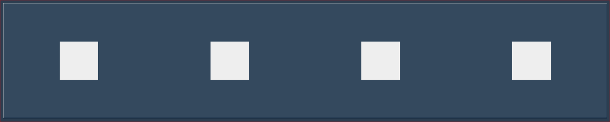

# 1.1 Parents with Many Children

---

You have mastered placing single items within a flexbox and grid. Next up you will tackle containers\(parents\) with multiple items\(children\).

---

### Flexbox

Focus:_ flex container with multiple flex items_

| Properties | Values |
| :--- | :--- |
| flex-direction | row & row-reverse |
| flex-wrap | column & column-reverse |
| justify-content | no-wrap & wrap |
| align-items | start |
| align-contents | end |
|  | center |
|  | space-between |
|  | space-around |

Adjust your code to reflect the following:

```html
<div class=parent "flex-container">
  <div class=childA></div>
  <div class=childB></div>
  <div class=childC></div>
  <div class=childD></div>
</div>
```

```css
.flex-container{
/*1. create flex layout context  */
  display: flex;

/*2.  define flow direction/wrap */
  flex-direction: row;
  flex-wrap: wrap;

/*3.  define distribution of remaning space*/
  justify-content: space-around;
  background: #ccc;
  border: 1px solid #ccc;
  color: #34495e;
}
```

Notice the white space within the container is evenly spaced around each item, even though each item is a different size.



---

### Explore  More

###### **SHORTHAND SYNTAX**

* ##### _ flex-flow: &lt;direction&gt; \|\| &lt;wrap&gt;_

  * ###### for flex-direction and flex-wrap \(applies only to parent\)

###### **NOTE**

* ###### Items will be laid out in a horizontal line
* ###### Items will start on the left
* ###### Items will retain their width

---

### Grid

Focus: _grid container with multiple grid items_

Adjust your code to reflect the following:

```html
<div class="grid-container">
  <div>One</div>
  <div>Two</div>
  <div>Three</div>
  <div>Four</div>
  <div>Five</div>
</div>
```

```css
.grid-container {
  border: 4px solid teal;
  border-radius: 5px;
  background-color: rgba(0,128,128,0.3);
  color: rgba(0,128,128,0.1);
}

.grid-container > div {
  border: 2px solid teal;
  border-radius: 5px;
  background-color: rgba(0,128,128,0.3);
  padding: 1em;
  color: #FFF;
}

.child {
  border: 2px solid teal;
  border-radius: 5px;
  background-color: #FFF;
  padding: 1em;
}
```


---

### 

###### **QUESTIONS**

1. ###### What happens when there are too many items to fit in the row? set to wrap? set to nowrap? What if the items are different sizes?
2. ###### Take a moment to play around with: flow-direction, flow-wrap, justify-content, align-content, align-items properties and values
3. ###### What is the difference between flexbox and grids with multiple items inside a grid?
4. ###### What happens when you  use the following values? space-around, space-between, center, flex-start?

---

### Challenges

#### Gold:

##### Create a navbar across the top of the page \(A: use flexbox, B: use grid\)

* center menu items evenly
* distribute space evenly around items relative to the container, not the individually sized items

#### Blue:

##### Create a navbar located horizontally on the left side of the page \(A: use flexbox, B: use grid\)

#### Red:

##### in your navbar ...

* align  menu items in centered, align-left, align-right
* place the menu items in a list at the top \(centered? bottom?\) of the column 

---

#### Answers

**Gold \(flexbox\)**

```html
<div>
    <ul class="flex-container">
       <li><h3>Home</li>
       <li><h3>About</li>
       <li><h3>Contact</li>
       <li><h3>Login</li>
    </ul>
</div>
```

```css
.navigation li{
  display: flex;
  flex-flow: flex-end;
  justify-content: center space-around; /*aligns items to end line on main-axis*/
  list-style-type: none;
}
```


**Gold \(grid\)**

```

```

**Blue \(flexbox\)**

```

```

```css
.box {
          display: flex;
          flex-direction: row-reverse;
        }
        .box :nth-child(1) { order: 2; }
        .box :nth-child(2) { order: 3; }
        .box :nth-child(3) { order: 1; }
        .box :nth-child(4) { order: 3; }
        .box :nth-child(5) { order: 1; }
```

```html
        <div class="box">
            <div><a href="#">1</a></div>
            <div><a href="#">2</a></div>
            <div><a href="#">3</a></div>
            <div><a href="#">4</a></div>
            <div><a href="#">5</a></div>
        </div>      <div class="box">
            <div><a href="#">1</a></div>
            <div><a href="#">2</a></div>
            <div><a href="#">3</a></div>
            <div><a href="#">4</a></div>
            <div><a href="#">5</a></div>
        </div>
```

```

```

**Red \(flexbox\)**

As an example, I have 5 flex items, and assign`order`values as follows:

* Source item 1:
  `order: 2`
* Source item 2:
  `order: 3`
* Source item 3:
  `order: 1`
* Source item 4:
  `order: 3`
* Source item 5:
  `order: 1`

These items would be displayed on the page in the following order:

* Source item 3:
  `order: 1`
* Source item 5:
  `order: 1`
* Source item 1:
  `order: 2`
* Source item 2:
  `order: 3`
* Source item 4:
  `order: 3`

order: default value of 0 so will come after any elelment that doesn't have an explilcit order value \(values are integers and can be negative \(-1\) or positive \(2\). order is a sub-property of FB layout module

```html
<div class="box">
    <div><a href="#">One</a></div>
    <div><a href="#">Two</a></div>
    <div><a href="#">Three</a></div>
</div>
```

```css
order property
    .box {
  display: flex;
  flex-direction: row-reverse;
}
```

**Red \(grid\)**

```css
  .box {
          display: flex;
          flex-wrap: wrap;
          flex-direction: row;
        }
        .active {
            order: -1;
            flex: 1 0 100%;
        }
```

```html
 <div class="box">
            <div><a href="#">1</a></div>
            <div><a href="#">2</a></div>
            <div class="active"><a href="#">3</a></div>
            <div><a href="#">4</a></div>
            <div><a href="#">5</a></div>
        </div>
```


