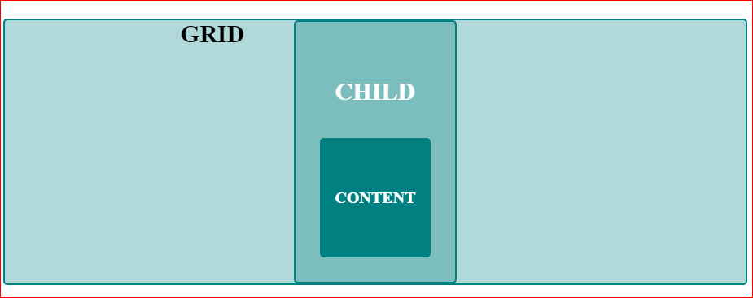

# Intro: FLEXBOXES & GRIDS

---

Flexbox is a method used to layout a website. Grids are a method used to layout a website. You may be asking yourself, "Does one replace the other?" No. Although similar, grids and flexboxes are different. It is best to think about them as complementary methods to structure the layout of a web site. Sort of like peanut butter and jelly.

> Flexbox is for one-dimensional layouts - anything that needs to be laid out in a straight line \(or in a broken line, which would be a single straight line if they were joined back together\). Grid is for two-dimensional layouts. It can be used as a low-powered flexbox substitute \(we’re trying to make sure that a single-column/row grid acts very similar to a flexbox\), but that’s not using its full power. - Tab Atkins

There is a lot to learn about these two methods, their properties and values.  In addition to what you will learn here, there are  many excellent resources out there. \(Links to these resources provided in glossary\)

---

---

## Horizontal & Vertical AXIS

_**Flexbox** **layout**_ distributes space along a SINGLE COLUMN \(the cross-axis\) OR ROW \(the main-axis\). Similar to _floats_ but better!

_**Grid** **layout**_ divides space into COLUMNS \(block or column axis\) AND ROWS \(inline or row axis\). Similar to _tables_ but better!

###### 

| Flexbox | Grid |
| :--- | :--- |
|  |  |
|  |  |

## In Action

Focus:

**Flexbox** container with centered item

* | Property | Value |
  | :--- | :--- |
  | display | flex |

Copy and paste the following code. You should see a white square\(item/child\) centered inside a blue rectangle\(container/parent\).

```html
<div class="parent">
  <div class="child"></div>
</div>
```

```css
.parent{
  display: flex;
  height: 300px;
  background: #34495e;
  border: 1px solid #ccc;
}
.child{
  width: 100px;
  height: 100px;
  margin: auto;
  background: #eee;
```


---

Focus

**Grid** container with centered item

| PROPERTIES | VALUES |
| :--- | :--- |
| display | grid |
| grid-template-columns | repeat |
| grid-template-rows | fr |
| justify-content |  |

```html
<div class="grid-parent">GRID
  <div class="grid-child">
    <div>
    <h4>CHILD</h4>
        <div class="item a"><h6>CONTENT<h6></div>
    </div>
  </div>
</div>
```

```css
.grid-parent {
  display: grid;
  border: 2px solid rgb(0,128,128);
  border-radius: 5px;
  background-color: rgba(0,128,128,0.3);
  text-align: center;
  justify-content: center;
}

.grid-child {
  display: grid;
  grid-template-columns: repeat(2fr);
  grid-template-rows: repeat(2fr);
  background-color: rgba(0,128,128,0.3);
  text-align: center;
}

* {box-sizing: border-box;}

  .item {
        width: auto;
        height: 50%;
        background-color: teal;
        color: #fff;
        border-radius: 5px;
        padding: .5em;
        font-size: 100%;
    }
```



\*This is what is called a_** nested grid**_.  The** item** class\(CONTENT\) is located within the **grid-child **class\(CHILD\), which is centered within the** grid-parent** class\(GRID\).

Source order matters : source order of html of a page can affect users when CSS re-orders visually.  source-order vs display order not unique to flexbox and grids.  [http://adrianroselli.com/2015/10/html-source-order-vs-css-display-order.html](http://adrianroselli.com/2015/10/html-source-order-vs-css-display-order.html) for examples of flexbox order none order.  FB and g allow us to separate content and presentation.  Grids: can layer items, explicitly state where an element sits on the grid and even mix items with explicit positioning with those that will layout according to Grid's auot-placement algorithm.  Great value in using sub-grids within grids. declare elements on the grid as subgrid


