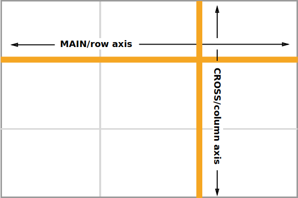
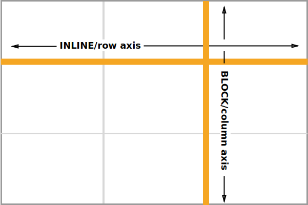
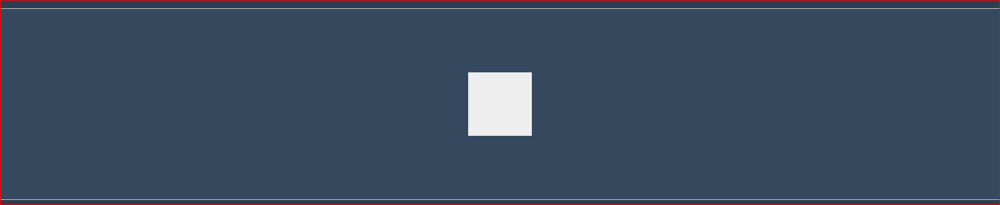

# Intro: FLEXBOXES & GRIDS

---

CSS Flexbox is a method used to layout a website. Grids are a method used to layout a website. These tools allow developers to separate content and presentation. They give an independence to our content that we didn't have before but we need now, and forever, going forward.  
 You may be asking yourself, "Does one replace the other?" No. Although similar, grids and flexboxes are different. It is best to think about them as complementary methods to structure the layout of a web site.

> Flexbox is for one-dimensional layouts - anything that needs to be laid out in a straight line \(or in a broken line, which would be a single straight line if they were joined back together\). Grid is for two-dimensional layouts. It can be used as a low-powered flexbox substitute \(we’re trying to make sure that a single-column/row grid acts very similar to a flexbox\), but that’s not using its full power. - Tab Atkins

There is a lot to learn about these two methods, their properties and values.  In addition to what you will learn here, there are many excellent resources out there. \(Links to these resources provided in glossary\)

---

## Horizontal & Vertical AXIS

_**Flexbox** **layout**_ distributes space along a SINGLE COLUMN \(the cross-axis\) OR ROW \(the main-axis\). Similar to _floats_ but better!

_**Grid** **layout**_ divides space into COLUMNS \(block or column axis\) AND ROWS \(inline or row axis\). Similar to _tables_ but better!

| Flexbox | Grid |
| :--- | :--- |
|  |  |
|  |  |

## In Action

Both tools utilize **containers** \(**parents**\) and **items **\(**child**\).

Let's dive right in and take a look at how **flexbox** and **grid** handle the common task of centering an **item** on a page.

## **Flexbox**

Focus: _container with centered item_

* | Property | Value |
  | :--- | :--- |
  | display | flex |

Copy and paste the following code. You should see a white square\(item/child\) centered inside a blue rectangle\(container/parent\).

```html
<div class="flex-parent">
  <div class="flex-child"></div>
</div>
```

```css
.flex-parent{
  display: flex;
  height: 300px;
  background: #34495e;
  border: 1px solid #ccc;
}
.flex-child{
  width: 100px;
  height: 100px;
  margin: auto;
  background: #eee;
```



---

## **Grid**

Focus: _container with centered item_

| PROPERTIES | VALUES |
| :--- | :--- |
| display | grid |
| grid-template-columns | repeat |
| grid-template-rows | fr |
| justify-content |  |

```html
<div class="grid-parent">GRID
  <div class="grid-child">
    <div>
    <h4>CHILD</h4>
    </div>
  </div>
</div>
```

```css
.grid-parent {
  display: grid;
  border: 2px solid rgb(0,128,128);
  border-radius: 5px;
  background-color: rgba(0,128,128,0.3);
  text-align: center;
  justify-content: center;
}

.grid-child {
  display: grid;
  grid-template-columns: repeat(2fr);
  grid-template-rows: repeat(2fr);
  background-color: rgba(0,128,128,0.3);
  text-align: center;
}

* {box-sizing: border-box;}
```

\*This is what is called a _**nested grid**_.  The **item** class\(CONTENT\) is located within the **grid-child **class\(CHILD\), which is centered within the** grid-parent** class\(GRID\).

There are probably two\(2\) terms that you have questions about:** fr** and **em**.  These are units of measurements like px \(pixels\) and % \(percentage\).

---

absolute lengths: these are fixed and will appear exactly that size \(best not to use these for anything other than print in which you know the output medium and size.

cm - centimeters

mm - millimeters

in - inches

px\* -pixels\(1px = 1/96th of 1in\)

pt - points\(1pt = 1/72 of 1in\)

pc - picas \(1pc = 12 pt\)

[https://www.w3schools.com/cssref/css\_pxtoemconversion.asp](https://www.w3schools.com/cssref/css_pxtoemconversion.asp) resource conversion px to em/em to px

