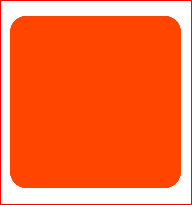

# Borders and Shapes

## Prep: copy and paste HTML

```html
<!--rounded corners example-->
  <div class="wrap">
  <div class="softie"></div>
  </div>

<!--targeted corners example-->
  <div class="wrap">
  <div class="picasso"></div>
  </div>

<!--ellipse/oval-->
  <div class="wrap">
  <div class="egg"></div>
  </div>

<!--shape experiment-->
  <div class="wrap">
  <div class="wonder"></div>
  </div>


  <div class="wrap">
    <div class="wrapper">
    <div class="circ1">
        <div class="circ2">
        </div>
    </div>
    </div>
  </div>
```

Corners. Corners are sharp. Corners are harsh. Now we are going to soften things up! This won't take very long. 

## Border radius

We'll make a square and round the corners by adding border-radius property. [Shapes HTML](Code: Shapes)

```css
.softie{
  background: orange;
  width: 300px;
  height: 300px;
  border-radius: 20px;
}
```

You should have created a orange box with rounded corners.  Notice how we didn't have a border on our square? You don't need a border, but you could have a border if you wanted one.


That is super nifty BUT we can go farther. We can use multiple values to create all sorts of shapes.

Let's try it out.

```css
.picasso{
  background: navy;
  width: 100px;
  height: 100px;
  border-top-left-radius: 20px;
  border-top-right-radius: 30px;
  border-bottom-left-radius: 5px;
  border-bottom-right-radius: 65px;
}
```

Does your shape look like this


Take a few minutes to play around with different values.

Alright, moving onward!

Having a sqaure and only 4 corners to work with is a little limiting for me. For you too? Good news, we can specify different horizontal and vertical radii by splitting the values with a '/'.

Make the following changes to class .picasso

```css
.egg{
  background: #2AD2FF;
  width: 100px;
  height: 150px;
  border-radius: 50px/100px;
  border-bottom-left-radius: 50px;
  border-bottom-right-radius: 50px;
}
```

../assets/egg.png)
Challenge: What happens when you increase the width & height? Try to fix it.  [Answer](#challenge-answer)

```css
.wonder{
  background: maroon;
  width: 250px;
  height: 250px;
  border-radius: 8em 18em 30em 50em/5em 30em 4em 90em;
  border-radius: 90em 10em 70em/ 50em 30em; 
  position: relative;
  margin-top: 75px;
  display: inline-block;
}
```


Now create the following shapes

```css
.circ1{
  width: 9em;
  height: 9em;
  border-radius: 50%;
  background: #000;
  position: relative;
  display: inline-block;
}

.circ2{
  width: 9em;
  height: 9em;
  border: 30px solid #eee;
  background: #eee;
  border-top-left-radius: 8em;
  border-bottom-right-radius: 8em;
  position: relative;
  top: 70px;
  left: 165px;
}
```

What shape did it make?


What happens when you . . .

- change px to %? em? vh? vw?
- add a border? to only the top? bottom? left? right?
- add this line of code: border-radius: 10% 0 10% 50%/5% 10% 10% 50%?
- change values to numbers exceeding 100?

### Challenge Answer

```css
.egg{
  background: #2AD2FF;
  width: 200px;
  height: 350px;
  border-radius: 700% / 700%;
  border-bottom-left-radius: 700%;
  border-bottom-right-radius: 700%;
  position: relative;
  margin-top: 70px;
  display: inline-block;
}
```