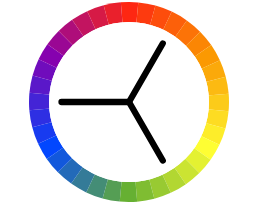
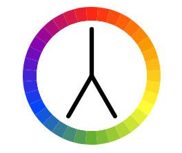

# GENERAL INTRO
CSS is a stylesheet language that describes the presentation of an HTML (or XML) document.
CSS describes how elements must be rendered on screen, on paper, or in other media.

CSS(CSS3) — CSS stands for _Cascading Style Sheet_ it is used for styling web pages, with the help of css, you can style web pages, websites, etc..

W3.css — w3.css is a CSS framework, built for responsive web design like bootstrap. That means you can create responsive websites with the help of w3.css.
Hope it will help you…


# Part 3.0: COLORS

A big part of a successful website is how it looks to the user. Styling goes beyond where you place items on your site. We will be exploring colors more in depth. When thinking about color, you need to keep in mind the target audience, accessabilty and psychology. 

We will cover:
```
Color Theory
HSL
Transparency
Gradients
```

## COLORS

We know that colors can be defined by name (Maroon), Hexadecimal and RGB values. Another value to expand color choices is HSL and Transparency.

Example: dark red
    #8000
    Maroon
    rgb(128,0,0)
    rgba(128,0,0,1.0)
    hsl(0,100%,13%)
    hsla(0,100%, 13%, 1.0)
    
  
    
    
Opacity property applies to element AND all of its children. This can make the text inside a fully transparent element hard to read:
```
background: rgb(128,0,0);
opacity: 0.6;
```


a(alpha) has no impact on other css properties or descendants. The alpha parameter is a number between 0.0 (fully transparent) and 1.0 (fully opaque).

```
background: rgb(128, 0, 0, 0.6 )
```


Any text in halfopaque div will be 50% opaque while text in halfalpha div will be black/only background color of that single element will be slightly opaque (background-color is not inherited property(?))

Example:
```
div.halfopaque {
  background-color: rgb(0, 0, 0);
  opacity: 0.5;
  color: #000000;
}

div.halfalpha {
  background-color: rgba(0, 0, 0, 0.5);
  color: #000000;
}
```

### HSL/HSLA
_Hue, Lightness and Saturation (Alpha)_

HSL mimics the way humans perceive color. It is intuitive and is quicker and easier to make changes*


```
H = Hue (0-359)
    0(or 360) is red
    120 is green
    240 blue
S = Saturation (%, 100% = full saturation)
L = Lightness (%, 100% = light/white, 50% = norm, 0% = dark/black)
```

### Color Theory


```
Primary (for our purposes: red, blue, green)
Primary colors are the main colors in a given color system.

Secondary (Orange, Green, Violet)
Secondary colors are made by mixing two primary colors in a color system.

Tertiary (Red-Orange, Yellow-Orange, Yellow-Green, Blue-Green, Blue-Purple, Red-Purple)
Tertiary colors are made by mixing two secondary colors in a color system.
```


Color Wheels - showing the relationship between primary, secondary, and tertiary colors

Color Scheme - logical combinations of colors/purpose to create an aesthetic feeling of style and appeal.

Black on white is the default web color scheme.
White on black is often preferred for smaller devices.

**White on black requires less energy (battery life) on most display technologies. 

The importance of color in design is because of accessability, target audience, and human psychology.


### Schemes

Monochromatic - use only one color using different tones, but same hue.

Analogous - using colors that are next to each other on the color wheel.

Complementary - combining colors from opposite sides of wheel.

Triadic - made up of hues equally spaced around the wheel.


Compound - uses colors on both sides of the opposite hue.


### Resources:
https://www.w3schools.com/colors/colors_schemes.asp

https://css-tricks.com/almanac/properties/o/opacity/


