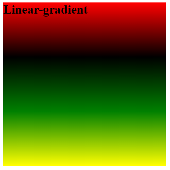

# Part 3.1 GRADIENTS


## GRADIENTS

_Gradients_ is defined as the smooth transition between two or more colors. Using gradients is an easy way to add depth and dimension.  

There are 2 types of gradients:

    1. Linear (goes down/up/left/right/diagonally)
    2. Radial (defined by their center)
    

  ### Linear Gradient  

In order to create a _linear gradient_ you need to choose at least two color-stops. Color-stops are the colors which you want to transition between. You can also choose which direction you want your colors to go.

Key Directional Phrases:
```
    top to bottom (the default position)
    to left
    to right
    to top left
    to bottom left
    to top right
    to bottom right 
   ``` 


```
background: linear-gradient(direction, color-stop1, color-stop2, ...);
```


Example:
```
 background: linear-gradient(to bottom, red, black, green, yellow);
 ```
 
 

 ####_Using Angles:_
 If you would like more control over the direction of the gradient, you can define an angle, instead of using the predefined directions.
 ```
  background: linear-gradient(50deg, yellow, pink, black);
  ```

 

 When using an angle, 0deg creates a vertical gradient running bottom to top, 90deg creates a horizontal gradient running left to right, and so on in a clockwise direction. Negative angles run in the counterclockwise direction.


 In Module 2.0 we talked about colors and all the different ways we can achieve the same colors (Hex, RGBA and HSLA). Well we can use those same color codes here in gradients.

 Example:
 ```
   background:linear-gradient(to bottom right, #FF00FF 25%, #FF0080 50%, #80FF00 75%);
  ```
  


_CHALLENGE:_
Using four different colors, two of your choice, create a linear gradiant in any shape of any size. Make sure it starts with red and ends with black. You must use Hex-code for the two colors of your choice.*


### Radial Gradients
_Radial gradients_ are similar to linear gradients except that they are circular or elliptical (default). Radial gradients define the center of the gradient, size, shape and color stops. Color stops start in the center and proceed outward

Example:
```
 background: radial-gradient(circle, blue, pink, red);
 ```


```
 background: radial-gradient(pink, red, blue)
 ```
 


 Again like linear gradients, you can position each radial color stop with a percentage or absolute length. Position: top, right, left, center, or top center, bottom left, keeping in mind that default is center.


```
Size Parameters:
    closest-side(smallest)
    closest-corner
    farthest-side
    farthest-corner(largest)
    length or percentage (only for ellipses)
    ```


Example:

```
 background: radial-gradient(circle closest-side,
      black, green 10%, #1e90ff 50%, yellow);

```


```
 background: radial-gradient(circle farthest-side at 60% 55%,
      black, green 10%, #1e90ff 50%, yellow);
```


       
Position: top, right, left, center, or top center, bottom left, default is center


### Hard Color Stops
You don't have to leave your color stops at their default positions. To fine-tune their locations, you can give each one a percentage or absolute length value. They are
useful for declaring a full-height background that simulates columns or stripes.


Example:

```
background: linear-gradient(to right, orange, orange 25px, red, red 77%, black 85%);
```


### RESOURCES
John Allsop’s CSS3 Sandbox  http://www.westciv.com/tools/gradients/

Damian Galarza’s Gradient Generator  http://gradients.glrzad.com/

https://webgradients.com/

http://paletton.com/#uid=1000u0kllllaFw0g0qFqFg0w0aF

https://htmlcolorcodes.com/color-names/

http://www.colorhunt.co/

http://hex2rgba.devoth.com/

### TERMINOLOGY

alpha-channel: transparency

