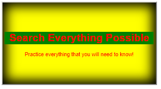

#SHADOWS

With CSS you can add shadow to text and to elements.

```
In this module you will learn about the following properties:
    box-shadow
    text-shadow
```

The _box-shadow_ CSS property is used to add shadow effects around an element's frame. You can specify multiple effects separated by commas if you wish to do so. A box shadow is described by X and Y offsets relative to the element, blur and spread radius, and color.


```
box-shadow: [horizontal offset - X] [vertical offset - Y] [blur radius] [optional spread radius] [color];
```


1. The _horizontal offset_ (required) of the shadow, positive means the shadow will be on the right of the box, a negative offset will put the shadow on the left of the box.

2. The _vertical offset_ (required) of the shadow, a negative one means the box-shadow will be above the box, a positive one means the shadow will be below the box.

3. The _blur radius_ (required), if set to 0 the shadow will be sharp, the higher the number, the more blurred it will be, and the further out the shadow will extend. For instance a shadow with 5px of horizontal offset that also has a 5px blur radius will be 10px of total shadow.

4. The _spread radius_ (optional), positive values increase the size of the shadow, negative values decrease the size. Default is 0 (the shadow is same size as blur).

5. _Color_ (required) - takes any color value, like hex, named, rgba or hsla. If the color value is omitted, box shadows are drawn in the foreground color (text color). But be aware, older WebKit browsers (pre Chrome 20 and Safari 6) ignore the rule when color is omitted.


**_EXAMPLE OF BOX SHADOW:_**


The CSS _text-shadow_ property applies shadow to text. It accepts a comma-separated list of shadows to be applied to the text and any of its decorations. Each shadow is described by some combination of X and Y offsets from the element, blur radius, and color.

In its simplest use, you only specify the horizontal shadow (2px) and the vertical shadow (2px):


**_EXAMPLE OF TEXT SHADOW:_**


**INNER SHADOW**

Even at their most complex, inset box-shadows are pretty easy to wrap your mind around. Toss in the word “inset” and your drop shadow becomes an inner shadow. Super simple. Unfortunately, text-shadow gives us a lot more trouble here. The “inset” value isn’t compatible with text-shadow.

```
button {
box-shadow: inset 0 0 45px 10px black;
}
```

**_EXAMPLE OF INNER SHADOW:_**




#TRANSFORMS

The _transform_ CSS property lets you rotate, scale, skew, or translate a given element. This is achieved by modifying the coordinate space of the CSS visual formatting model.

A transformation is an effect that lets an element change shape, size and position.

CSS supports 2D and 3D transformations.

```
The following 2D transformation methods:

    translate(n, n)
    rotate(x, y)
    scale(x, y)
    skewX(x, y)
    skewY(x, y)
    matrix(n, n, n, n, n, n)
```
The transform function moves an element sideways, or up and down.

It can rotate an element clockwise from its original position, whilst a negative value would rotate it in the opposite direction.

The skewX and skewY transform functions tilt an element one way or the other.

The matrix transform function can be used to combine all transforms into one. It's a bit like transform shorthand.


Checkout the link below for further explanation and code example:

https://codepen.io/captainbrosset/pen/lHpnK


_RESOURCES:_

    https://css-tricks.com/almanac/properties/b/box-shadow/
    https://www.w3schools.com/css/css3_shadows.asp
    https://css-tricks.com/almanac/properties/t/transform/
    https://developer.mozilla.org/en-US/docs/Web/CSS/text-shadow
    https://mayvendev.com/blog/inner-shadows-in-css-images-text-and-beyond
