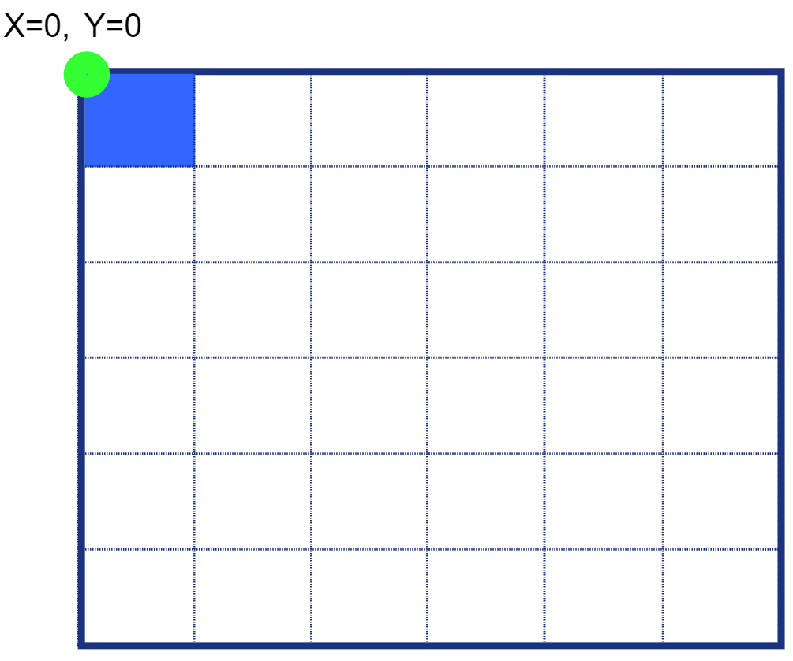
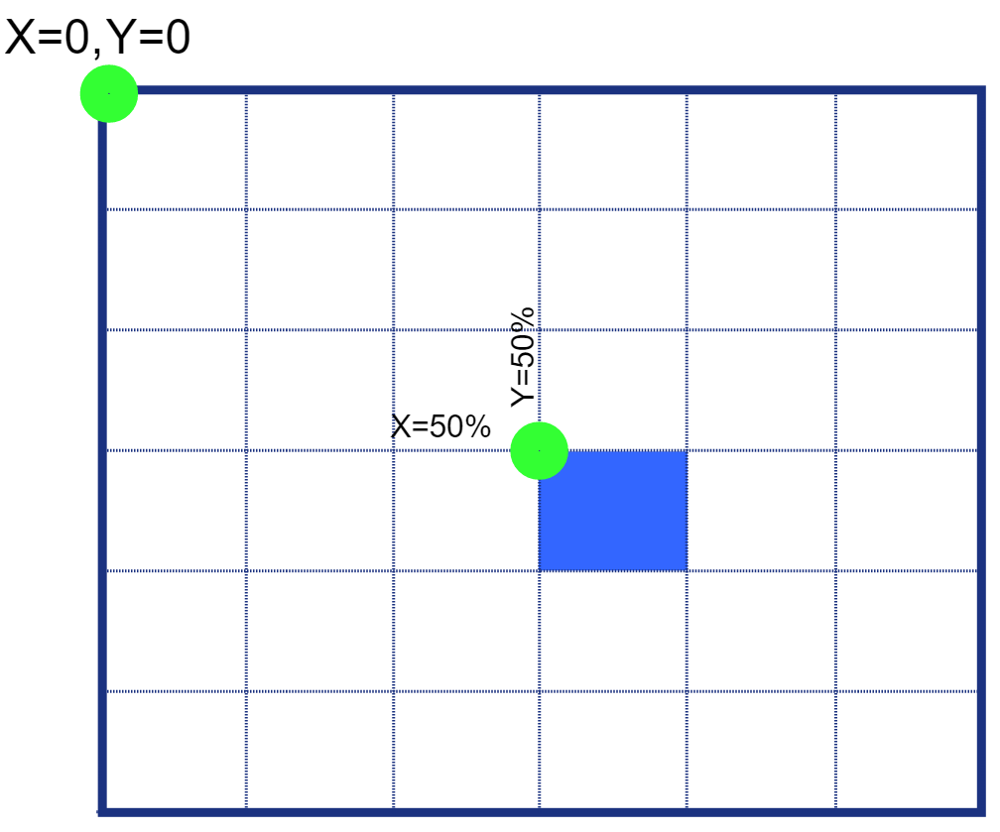

# 5.0 Positioning Elements

---

## Oh where, oh where will I put you'?'

Positioning is crucial to a making a site or image look exactly how you want it to at all times. The position property is one of the factors that dictates the location of an element on a document. Positioning can cause headaches when first learning how the values function and interact with each other.

Elements have an original position on the screen. The position property helps you to control the placement of your elements.

| Properties | Values |
| :--- | :--- |
| position | static \(default\) |
| top | relative |
| left | inherit |
| bottom | fixed |
| right | absolute |
| z-index | sticky |

## Understanding Document Layout

As someone begins to think about  laying out their web site, they will think in their heads of how it will look on the screen.  Primarily, because sites have many layers, it is better to think of what you are trying to style as a document. As we move through this chapter you will gain a better understanding of why this is for your benefit.

As you see from fig. 1, the document is the lower right quadrant of a mathematical grid.  The top left corner of a document or element is 0,0.

When positioning an element or item, the computer will use the intersection point of x and y as its orientation.  In fig. 2,  we tried to position the blue square in the center of the document by setting property top & left to 50%, intending to move the square halfway down the page and halfway across. However, because of the orientating point being the intersection of x and y the square itself is not centered, but the top left corner of the square is. We will address adjusting for this later on.

\*this is great if we know the exact size of an element, not so much if we don't. This will be explored in the transform/transition chapter
