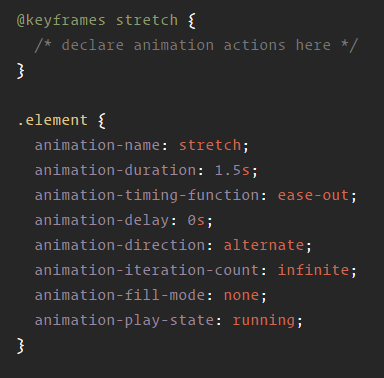

# Part 8.0 Animations

---

CSS animations make it possible to animate transitions from one CSS style configuration to another. Animations consist of two components, a style describing the CSS animation and a set of keyframes that indicate the start and end states of the animation’s style, as well as possible intermediate waypoints.

---

There are three key advantages to CSS animations over traditional script-driven animation techniques:

1. They’re easy to use for simple animations; you can create them without even having to know JavaScript.

2. The animations run well, even under moderate system load. Simple animations can often perform poorly in JavaScript (unless they’re well made). The rendering engine can use frame-skipping and other techniques to keep the performance as smooth as possible.

3. Letting the browser control the animation sequence lets the browser optimize performance and efficiency by, for example, reducing the update frequency of animations running in tabs that aren't currently visible.
    

The _animation_ property in CSS can be used to animate many other CSS properties such as color, background-color, height, or width. Each animation needs to be defined with the @keyframes at-rule which is then called with the animation property.

###Sub-Properties
|Property | Description
| :------ | :---------
| @keyframes: | specifies the animation code.
| animation-name: | declares the name of the @keyframes at-rule to manipulate.
| animation-duration: | the length of time it takes for an animation to complete one cycle.
| animation-timing-function: | establishes preset acceleration curves such as ease or linear.
| animation-delay: | the time between the element being loaded and the start of the animation sequence.
| animation-direction: | sets the direction of the animation after the cycle. Its default resets on each cycle.
| animation-iteration-count:| the number of times the animation should be performed.
| animation-fill-mode: | sets which values are applied before/after the animation. For example, you can set the last state of the animation to remain on screen, or you can set it to switch back to before when the animation began.
| animation-play-state: | pause/play the animation.

Example code:

### RESOURCES

https://developer.mozilla.org/en-US/docs/Web/CSS/CSS_Animations/Using_CSS_animations

https://css-tricks.com/almanac/properties/a/animation/

https://www.w3schools.com/css/css3_animations.asp

