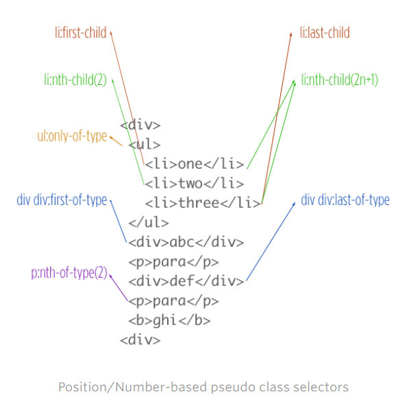
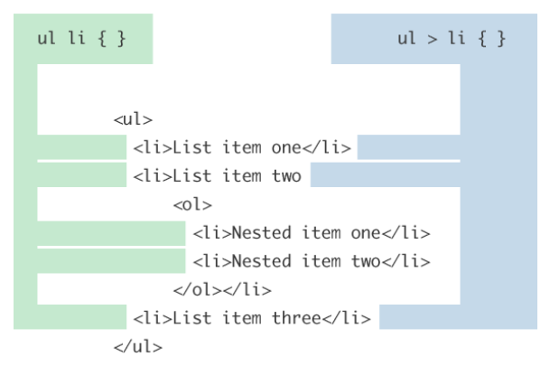
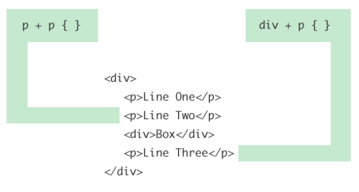
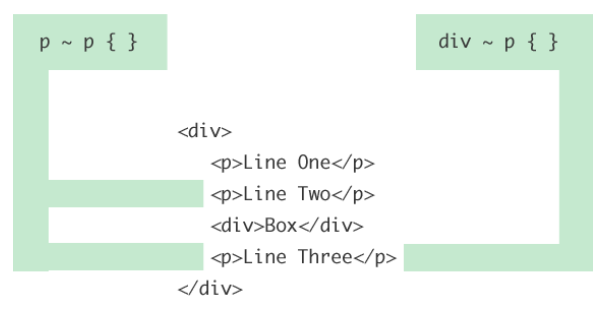

# 0.04 Selectors and Combinators

---

rendering efficiency - same concepts apply to js. not vital but a good to know thing - browsers read css selectors right to left 
so a[title="home"] [title="home"] is read first.
same with combined selectors (#main-nav {} (id (fastest)), body.home #page-wrap{} (id), .main-nav (class), ul li a.current {} (class), ul {}(tag), ul li a (tag), * {}(universal(slowest)), #content [title='home'](universal)

'#'main-nav > li {} isn't very efficient. more efficient would be '#'main-nav {font-size: 14px;} than '#'main-nav li a {font-size: 14px;} because it cascades may not need selector at all, not efficient either is - html body ul li a {}
take-away: don't sacrifice semantics or maintainability for efficient css

Attribute selectors ([]) allow developers to target specific HTML elements and apply stye to them. CSS specificity https://css-tricks.com/how-css-selectors-work/
and
https://css-tricks.com/almanac/ (selectors and properties)

https://css-tricks.com/attribute-selectors/

You are already familiar with class and id selectors
there are also
key selectors
id
class
tag
universal
(same order for how efficient they are)

attribute([ ], 7 different types)
positional
pseudo selectors (":", usual for a variety of situations, here are a sample: nth-child(), nth-of-type(), first-child, visited, hover, active)


relational pseudo(first letter)

chaining pseudo class selectors (ex. p:first-child:first-letter{}, will enlarge the first letter of the first paragraph(dropcap))
universal selector(*)

'#' is ID selector
'.' is class selector

tag selector (ie div p h2)
attribute selector (same specificity value as classes)???

positional selectors(:nth-child(2), 3n = "every third")

pseudo elements ("::", before, after(selects some actual content)) and pseudo selectors(selects elements in certain conditions) are different. Also checkout specificity, deprecated, tag qualification, and jQuery usage.

selectors can be combined together and selector combinators

child selector (>)
descendant selector (space)
adjacent sibling selector (+)
general sibling selector (~)

Descendant selector (space)
    selects any that are anywhere in the markup structure.

```css
div p {
    background-color: purple;
}
```

Child selector (>)
    select only items one level down(direct) the markup structure

```css
div > p {
    background-color: purple;
}
```

Sibling elements must have the same parent element - sharing the same parent

adjacent means "immediately following"

Adjacent Sibling selector (+)
    *selects all elements that are the ad sib to specified element
    example: all <p> elements that are placed immediately after <div> elements

```css
div + p {
    background-color: purple;
}
```

General sibling selector (~)
    *selects all elements that are siblings of a specified element.
    example: all <p> that are siblings of <div> elements

```css
div ~ p {
    background-color: purple;
}
```

examples to illustrate child and sibling combinators.

descendant(green) and child(blue)







You can dive deeper into selectors and combinators but this all we are going to cover here.